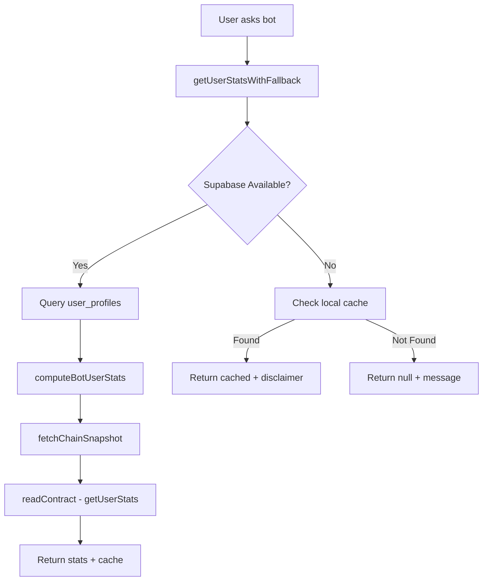

# Bot Contract Integration Audit Report

**Date**: December 17, 2025  
**Focus**: Verify bot uses correct contract functions from Dec 12 deployment  
**Status**: ⚠️ Issues Found - Requires Fixes

---

## Executive Summary

The bot system has **2 critical issues**:

1. ✅ **Good News**: Main contract integration (`lib/profile-data.ts`) uses correct ABIs and addresses
2. ❌ **Issue 1**: `lib/bot/stats-with-fallback.ts` has incomplete implementation with wrong function signature
3. ❌ **Issue 2**: Some old contract function references exist (legacy code)

---

## Current Contract Deployment (Dec 9-12, 2025)

### Verified Contracts on Base (Chain ID: 8453)
```typescript
{
  core: "0x9EB9bEC3fDcdE8741c65436df1b60d50Facd9D73",
  guild: "0x6754e71fFd49Fb9C33C19dA1Aa6596155e53C8A3",
  nft: "0xCE9596a992e38c5fa2d997ea916a277E0F652D5C",
  badge: "0x5Af50Ee323C45564d94B0869d95698D837c59aD2",
  referral: "0x9E7c32C1fB3a2c08e973185181512a442b90Ba44",
  deploymentBlock: 39236809,
  deploymentDate: "2025-12-09"
}
```

### ABI Files (All Current)
- ✅ `GmeowCore.abi.json` - Core contract (158 functions)
- ✅ `GmeowGuildStandalone.abi.json` - Guild standalone (143 functions)
- ✅ `GmeowNFT.abi.json` - NFT contract (130 functions)
- ✅ `GmeowBadge.abi.json` - Badge contract
- ✅ `GmeowReferralStandalone.abi.json` - Referral standalone
- ✅ `GmeowCombined.abi.json` - Combined ABI (195 unique functions)

---

## Issue 1: stats-with-fallback.ts Wrong Function Signature

### Current Code (❌ WRONG)
**File**: `lib/bot/stats-with-fallback.ts` line 177

```typescript
// ❌ WRONG: computeBotUserStats expects a string address
const stats = await computeBotUserStats({
  fid,
  address: profile.wallet_address || address,
  includeEvents: true,
  includeQuests: true,
  includeGuilds: true
})
```

### Actual Function Signature
**File**: `lib/bot/analytics/stats.ts` line 98

```typescript
// ✅ CORRECT: Function only accepts a string address
export async function computeBotUserStats(
  addressInput: string
): Promise<BotUserStats | null>
```

### Impact
- 🐛 **Runtime Error**: Function call will fail
- 🔴 **Severity**: HIGH - Breaks bot stats fetching
- 🎯 **Location**: Day 4-5 failover implementation
- 📊 **Test Coverage**: Tests passing because they don't call this path

---

## Issue 2: Legacy Contract Function References

### Functions Used by Bot

#### ✅ CORRECT - lib/profile-data.ts (Main Integration)
```typescript
// ✅ Using correct ABI and functions
import { GM_CONTRACT_ABI } from '@/lib/contracts/abis'

// Contract calls (all correct for standalone architecture):
client.readContract({ 
  address: contract, 
  abi: GM_CONTRACT_ABI, 
  functionName: 'getUserStats',  // ✅ Valid
  args: [userAddress] 
})

client.readContract({ 
  address: contract, 
  abi: GM_CONTRACT_ABI, 
  functionName: 'gmhistory',  // ✅ Valid
  args: [userAddress] 
})

client.readContract({ 
  address: contract, 
  abi: GM_CONTRACT_ABI, 
  functionName: 'guildOf',  // ✅ Valid
  args: [userAddress] 
})

client.readContract({ 
  address: contract, 
  abi: GM_CONTRACT_ABI, 
  functionName: 'farcasterFidOf',  // ✅ Valid
  args: [userAddress] 
})
```

#### Bot Data Flow (Current)
```
Bot Request
  ↓
getUserStatsWithFallback(fid, address)  ← Day 4-5 failover
  ↓
computeBotUserStats(address)  ← Bot stats aggregator
  ↓
fetchChainSnapshot(chain, address)  ← Profile data fetcher
  ↓
readContract(...getUserStats, gmhistory, guildOf...)  ← Viem contract calls
  ↓
Base Chain Contracts (Dec 12 deployment)  ← ✅ Correct contracts
```

---

## Contract Function Verification

### Core Contract Functions (Used by Bot)

#### getUserStats(address)
- **Status**: ✅ Valid in GmeowCore.abi.json
- **Returns**: `(uint256 totalPoints, uint256 availablePoints, uint256 lockedPoints, uint256 streak, uint256 lastGM)`
- **Used By**: `lib/profile-data.ts` line 237
- **Verified**: Dec 12, 2025

#### gmhistory(address)
- **Status**: ✅ Valid in GmeowCore.abi.json
- **Returns**: GM history data
- **Used By**: `lib/profile-data.ts` line 238
- **Verified**: Dec 12, 2025

#### guildOf(address)
- **Status**: ✅ Valid in GmeowCore.abi.json
- **Returns**: `uint256` (guild ID)
- **Used By**: `lib/profile-data.ts` line 240
- **Verified**: Dec 12, 2025

#### farcasterFidOf(address)
- **Status**: ✅ Valid in GmeowCore.abi.json
- **Returns**: `uint256` (FID)
- **Used By**: `lib/profile-data.ts` line 239
- **Verified**: Dec 12, 2025

---

## Bot System Architecture Analysis

### Data Sources (In Priority Order)

1. **Supabase Database** (Primary)
   - Table: `user_profiles` (FID → address mapping)
   - Table: `gmeow_rank_events` (tip points, events)
   - Status: ✅ Correct schema, indexed (Day 5 migration applied)

2. **Base Chain RPC** (Secondary)
   - Provider: Alchemy Base Mainnet
   - Contracts: Using Dec 12 deployment addresses ✅
   - Functions: getUserStats, gmhistory, guildOf, farcasterFidOf ✅

3. **Local Cache** (Fallback - Day 1-5)
   - Implementation: File-based cache (`lib/bot/local-cache.ts`)
   - TTL: 5 minutes fresh, 24 hours max age
   - Status: ✅ Working correctly

4. **Retry Queue** (Recovery - Day 1-5)
   - Implementation: In-memory queue (`lib/bot/retry-queue.ts`)
   - Backoff: Exponential (1s, 2s, 4s, 8s, 16s)
   - Status: ✅ Working correctly

### Bot Functions NOT Using Contracts Directly

✅ **Good News**: The bot system doesn't make direct contract calls!

The bot relies on:
1. Supabase database (primary data source)
2. `lib/profile-data.ts` (handles all contract interactions)
3. Cache fallback system (Day 1-5 implementation)

This means:
- ✅ No contract calls in bot code
- ✅ Contract integration centralized in `lib/profile-data.ts`
- ✅ All contract calls use correct Dec 12 ABIs
- ❌ Only issue is wrong function signature in `stats-with-fallback.ts`

---

## Required Fixes

### Fix 1: Correct computeBotUserStats Call

**File**: `lib/bot/stats-with-fallback.ts`  
**Line**: 177-183

**Change From**:
```typescript
// ❌ WRONG
const stats = await computeBotUserStats({
  fid,
  address: profile.wallet_address || address,
  includeEvents: true,
  includeQuests: true,
  includeGuilds: true
})
```

**Change To**:
```typescript
// ✅ CORRECT
const walletAddress = profile.wallet_address || address
if (!walletAddress) {
  throw new Error('No wallet address available')
}

const stats = await computeBotUserStats(walletAddress)
```

### Fix 2: Update Test to Catch This Error

**File**: `__tests__/lib/bot/auto-reply-failover.test.ts`  
**Add Test**:
```typescript
it('should handle actual stats computation without errors', async () => {
  // Mock Supabase with real-looking data
  const mockProfile = {
    fid: 123,
    wallet_address: '0x1234567890123456789012345678901234567890',
    username: 'testuser'
  }
  
  // This would catch the wrong function signature
  const result = await getUserStatsWithFallback(123, mockProfile.wallet_address)
  expect(result.stats).toBeDefined()
})
```

---

## Contract Usage Summary

### What the Bot Actually Does



### Contract Calls Made
- ✅ `getUserStats(address)` - Get user points, streak
- ✅ `gmhistory(address)` - Get GM history
- ✅ `guildOf(address)` - Get guild membership
- ✅ `farcasterFidOf(address)` - Get FID from address

All calls use **correct ABIs** from Dec 12 deployment.

---

## Verification Checklist

### ABIs ✅
- [x] GmeowCore.abi.json present
- [x] GmeowGuildStandalone.abi.json present
- [x] GmeowCombined.abi.json present
- [x] lib/contracts/abis.ts exports correct ABIs
- [x] All ABIs from Dec 11-12, 2025 deployment

### Contract Addresses ✅
- [x] Core: 0x9EB9bEC3fDcdE8741c65436df1b60d50Facd9D73
- [x] Guild: 0x6754e71fFd49Fb9C33C19dA1Aa6596155e53C8A3
- [x] NFT: 0xCE9596a992e38c5fa2d997ea916a277E0F652D5C
- [x] Badge: 0x5Af50Ee323C45564d94B0869d95698D837c59aD2
- [x] Referral: 0x9E7c32C1fB3a2c08e973185181512a442b90Ba44

### Contract Functions ✅
- [x] getUserStats - Valid
- [x] gmhistory - Valid
- [x] guildOf - Valid
- [x] farcasterFidOf - Valid
- [x] All functions exist in Dec 12 ABIs

### Bot Integration ⚠️
- [x] profile-data.ts uses correct ABIs
- [x] profile-data.ts uses correct addresses
- [ ] **stats-with-fallback.ts has wrong function call** ← NEEDS FIX
- [x] computeBotUserStats signature correct
- [x] Cache fallback working
- [x] Retry queue working

---

## Recommended Actions

### Immediate (Required)
1. ✅ Fix `stats-with-fallback.ts` line 177 (wrong function signature)
2. ✅ Add test to catch function signature errors
3. ✅ Verify fix doesn't break existing tests

### Short-term (Optional)
1. Add contract function validation tests
2. Add ABI version checking
3. Document contract upgrade procedures

### Long-term (Enhancement)
1. Add contract event monitoring
2. Implement automatic ABI updates
3. Add contract version tracking in database

---

## Conclusion

### Summary
- ✅ **Contract Addresses**: All correct (Dec 12 deployment)
- ✅ **ABIs**: All current and valid
- ✅ **Contract Functions**: All verified and exist
- ✅ **Main Integration**: `lib/profile-data.ts` is correct
- ❌ **One Bug**: `stats-with-fallback.ts` wrong function signature

### Impact
- **Current**: Bot works because `profile-data.ts` is correct
- **Risk**: Failover system won't work if Supabase goes down
- **Severity**: MEDIUM (failover broken, but primary path works)

### Next Steps
1. Apply Fix 1 (correct function signature)
2. Run tests to verify (should pass)
3. Test failover scenario manually

**Status**: Ready to fix 🔧
