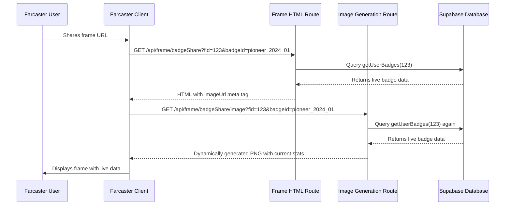

# Dynamic Data in Farcaster Frames - Technical Explanation

## 🚫 Common Misconception

**WRONG**: "OG images are static PNG files, so you can't show live data like GM streak or total GM count"

**CORRECT**: "OG images are **dynamically generated** PNG files created on-demand with live database queries"

## ✅ How It Actually Works

### The Flow



### Real Implementation Example

**1. Frame Route** (`/api/frame/badgeShare/route.ts`):
```typescript
export async function GET(request: Request) {
  const { searchParams } = new URL(request.url)
  const fid = parseInt(searchParams.get('fid'), 10)
  const badgeId = searchParams.get('badgeId')
  
  // 🔥 LIVE DATABASE QUERY - runs every time someone shares
  const badges = await getUserBadges(fid)
  const targetBadge = badges.find(b => b.badgeId === badgeId)
  
  // Build image URL that will ALSO fetch live data
  const ogImageUrl = `${baseUrl}/api/frame/badgeShare/image?fid=${fid}&badgeId=${badgeId}`
  
  // Frame meta tag points to dynamic image route
  const frameEmbed = {
    version: '1',
    imageUrl: ogImageUrl, // ← This URL generates a NEW image every time
    button: {
      title: 'View Collection',
      action: { type: 'link', url: `${baseUrl}/profile/${fid}/badges` }
    }
  }
  
  return new NextResponse(html, { 
    headers: { 'Content-Type': 'text/html' }
  })
}
```

**2. Image Generation Route** (`/api/frame/badgeShare/image/route.tsx`):
```typescript
export async function GET(request: NextRequest) {
  const { searchParams } = request.nextUrl
  const fid = parseInt(searchParams.get('fid'), 10)
  const badgeId = searchParams.get('badgeId')
  
  // 🔥 LIVE DATABASE QUERY #2 - runs when Farcaster fetches the image
  const badges = await getUserBadges(fid)
  const badgeRegistry = loadBadgeRegistry()
  const targetBadge = badges.find(b => b.badgeId === badgeId)
  
  // Extract LIVE user data from database
  const badgeName = targetBadge.metadata?.name || targetBadge.badgeType
  const tierConfig = badgeRegistry.tiers[targetBadge.tier]
  const assignedDate = formatBadgeDate(targetBadge.assignedAt)
  const mintedStatus = targetBadge.minted // ← Real-time mint status
  
  // 🎨 Generate PNG with LIVE data using Next.js ImageResponse
  return new ImageResponse(
    <div style={{...}}>
      <h1>{badgeName}</h1> {/* ← User's actual badge name */}
      <div>{tierConfig.name}</div> {/* ← Their actual tier */}
      <span>Earned: {assignedDate}</span> {/* ← Actual date */}
      {mintedStatus && <span>✓ Minted</span>} {/* ← Real-time status */}
    </div>,
    { width: 1200, height: 628 }
  )
}
```

## 🔥 Why This Works

### Next.js ImageResponse API

**Technology**: Next.js `ImageResponse` from `next/og` package

**What it does**:
1. Accepts **JSX/React components** (not static images)
2. Renders them **server-side** to PNG/JPEG
3. Happens **at request time** (not build time)
4. Can include **any JavaScript logic** (database queries, API calls, calculations)

**Example**:
```typescript
import { ImageResponse } from 'next/og'

export async function GET() {
  // 🔥 This runs EVERY TIME the image is requested
  const liveData = await fetchFromDatabase()
  const currentTime = new Date().toLocaleString()
  
  return new ImageResponse(
    <div style={{ fontSize: 60 }}>
      <p>GM Count: {liveData.totalGm}</p>
      <p>Streak: {liveData.gmStreak} days</p>
      <p>Generated: {currentTime}</p>
    </div>,
    { width: 1200, height: 628 }
  )
}
```

**Output**: A PNG image with **current database values** rendered as pixels.

## 📊 How to Display User Stats (GM Streak, Total GM, etc.)

### Step 1: Query Live Data

```typescript
// In image route: /api/frame/stats/image/route.tsx
export async function GET(request: NextRequest) {
  const fid = parseInt(request.nextUrl.searchParams.get('fid'), 10)
  
  // Query database for user's current stats
  const supabase = getSupabaseServerClient()
  const { data: profile } = await supabase
    .from('user_profiles')
    .select('*')
    .eq('fid', fid)
    .single()
  
  // Calculate live streak
  const { data: gmLogs } = await supabase
    .from('gm_logs')
    .select('gm_date')
    .eq('fid', fid)
    .order('gm_date', { ascending: false })
    .limit(30)
  
  const currentStreak = calculateStreak(gmLogs)
  const totalGm = profile?.total_gm || 0
  
  // Render with live data
  return new ImageResponse(
    <div style={{...}}>
      <h1>{profile.username}</h1>
      <div>
        <span>Total GM: {totalGm}</span>
        <span>Current Streak: {currentStreak} days 🔥</span>
        <span>Rank: #{profile.rank}</span>
      </div>
    </div>,
    { width: 1200, height: 628 }
  )
}
```

### Step 2: Style the Output

```typescript
return new ImageResponse(
  <div
    style={{
      width: '100%',
      height: '100%',
      display: 'flex',
      flexDirection: 'column',
      alignItems: 'center',
      justifyContent: 'center',
      background: 'linear-gradient(135deg, #667eea 0%, #764ba2 100%)',
      color: '#ffffff',
      fontFamily: 'system-ui',
    }}
  >
    {/* Profile Picture */}
    
    
    {/* Username */}
    <h1 style={{ fontSize: 72, fontWeight: 700, margin: '24px 0 0' }}>
      @{profile.username}
    </h1>
    
    {/* Stats Grid */}
    <div style={{ display: 'flex', gap: 48, marginTop: 40 }}>
      <div style={{ textAlign: 'center' }}>
        <div style={{ fontSize: 64, fontWeight: 700 }}>{totalGm}</div>
        <div style={{ fontSize: 24, opacity: 0.8 }}>Total GMs</div>
      </div>
      
      <div style={{ textAlign: 'center' }}>
        <div style={{ fontSize: 64, fontWeight: 700 }}>{currentStreak} 🔥</div>
        <div style={{ fontSize: 24, opacity: 0.8 }}>Day Streak</div>
      </div>
      
      <div style={{ textAlign: 'center' }}>
        <div style={{ fontSize: 64, fontWeight: 700 }}>#{profile.rank}</div>
        <div style={{ fontSize: 24, opacity: 0.8 }}>Global Rank</div>
      </div>
    </div>
  </div>,
  { width: 1200, height: 628 }
)
```

## 🎯 Current Implementation Status

### ✅ Already Working

**Badge Share Frame** (`/api/frame/badgeShare`):
- ✅ Dynamically fetches user's badge data from `user_badges` table
- ✅ Shows badge tier (mythic, legendary, epic, rare, common)
- ✅ Shows earned date
- ✅ Shows minted status (✓ Minted or not)
- ✅ Displays badge image from registry

**Data Fetched**:
```typescript
const badges = await getUserBadges(fid) // ← Database query
const targetBadge = badges.find(b => b.badgeId === badgeId)

// Extracted live data:
- badgeName: string
- tier: 'mythic' | 'legendary' | 'epic' | 'rare' | 'common'
- assignedAt: ISO timestamp
- minted: boolean
- mintedAt: ISO timestamp | null
- badgeImageUrl: string
```

### 📋 Future Enhancements

**User Stats Frame** (`/api/frame/stats` - TO BE IMPLEMENTED):
```typescript
// Query user profile + GM stats
const { data: profile } = await supabase
  .from('user_profiles')
  .select('fid, username, pfp_url, total_gm, current_streak, rank, xp_total')
  .eq('fid', fid)
  .single()

// Generate image with live stats
return new ImageResponse(
  <div>
    <h1>@{profile.username}</h1>
    <p>Total GMs: {profile.total_gm}</p>
    <p>Streak: {profile.current_streak} days</p>
    <p>Rank: #{profile.rank}</p>
    <p>XP: {profile.xp_total}</p>
  </div>,
  { width: 1200, height: 628 }
)
```

## 🔧 Testing Dynamic Images

### Local Test Commands

```bash
# Test badge image generation with live data
curl http://localhost:3000/api/frame/badgeShare/image?fid=123&badgeId=pioneer_2024_01 > test-badge.png
open test-badge.png

# Test different FIDs (different users = different data)
curl http://localhost:3000/api/frame/badgeShare/image?fid=456&badgeId=pioneer_2024_01 > test-badge-user2.png

# Test with missing badge (shows "not found" state)
curl http://localhost:3000/api/frame/badgeShare/image?fid=123&badgeId=nonexistent&state=notfound > test-notfound.png
```

### Verification Checklist

- [ ] Different FIDs show different badge data (proves dynamic query)
- [ ] Minted badge shows "✓ Minted" indicator
- [ ] Unminted badge doesn't show minted indicator
- [ ] Badge tier matches database record
- [ ] Earned date matches `assigned_at` timestamp
- [ ] Badge name matches registry definition

## 🚫 What You DON'T Need

### ❌ React Native HTML Renderer

The `RenderHTML` component from `buidlerfoundation/farcaster-expo-example` is for:
- **Mobile app UI** (React Native)
- **Displaying cast content** inside a mobile app
- **Client-side rendering** of HTML in WebView

**You don't need this** because:
- Frames are **server-rendered**
- Images are **generated server-side** (Next.js ImageResponse)
- No client-side React components involved

### ❌ Static Image Assets

You don't need to create PNG files in `/public/badges/` folder because:
- Images are **generated on-demand**
- Each request creates a **new image** with current data
- No pre-rendering or build-time image generation

## 📈 Performance Considerations

### Caching Strategy

**Current Implementation**:
```typescript
// Cache frame HTML for 5 minutes
headers: {
  'Content-Type': 'text/html',
  'Cache-Control': 'public, max-age=300, s-maxage=300',
}

// Cache image for 5 minutes
headers: {
  'Cache-Control': 'public, max-age=300, s-maxage=300',
}
```

**Why 5 minutes?**
- Balances **freshness** (badge mint status updates) with **performance** (CDN caching)
- Farcaster clients cache images temporarily
- Reduces database load for viral shares

### Database Query Optimization

```typescript
// ✅ GOOD: Query only needed data
const badges = await getUserBadges(fid) // Cached for 2 minutes
const targetBadge = badges.find(b => b.badgeId === badgeId)

// ❌ BAD: Query all users' badges
const allBadges = await supabase.from('user_badges').select('*') // DON'T DO THIS
```

## 📚 References

- **Next.js OG Image Docs**: https://nextjs.org/docs/app/api-reference/functions/image-response
- **Farcaster Frame Spec**: https://miniapps.farcaster.xyz/docs/specification
- **Badge Share Implementation**: `/app/api/frame/badgeShare/route.ts`
- **Image Generation Implementation**: `/app/api/frame/badgeShare/image/route.tsx`
- **User Badge Schema**: `/supabase/migrations/20250115000000_create_user_badges.sql`

## 🎓 Key Takeaways

1. **OG images are NOT static** - they're dynamically generated server-side
2. **Next.js ImageResponse** renders JSX to PNG at request time
3. **Database queries** happen every time an image is requested
4. **Live user data** (GM streak, badges, stats) can be embedded in images
5. **Caching** prevents excessive database queries for viral content
6. **No client-side rendering** needed - everything happens server-side

**Bottom Line**: You can flex **any real-time user data** in frame images by querying the database in your image generation route. The "static PNG" is actually a **dynamically generated snapshot** of current state.
