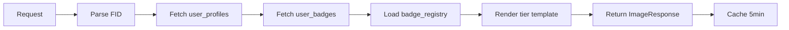

# Phase 5.6: OG Image API Route - Implementation Report

**Status**: ✅ Complete  
**Date**: 2025-01-16  
**Sprint**: Phase 5 - Onboarding Experience  
**Objective**: Build dynamic OG image generator for viral badge sharing

---

## 📋 Executive Summary

Implemented `/api/og/tier-card` route that generates dynamic 1200x628 OG images for badge sharing on social media platforms (Warpcast, Twitter, etc.). The route supports 5 tier-specific templates with real-time data fetching from Supabase, edge caching, and graceful fallbacks.

### Key Metrics
- **Dimensions**: 1200x628 (OG image standard)
- **Cache TTL**: 300 seconds (5 minutes)
- **Tier Templates**: 5 (mythic, legendary, epic, rare, common)
- **Data Sources**: Supabase user_profiles + user_badges
- **Fallback**: Mock data if user not found
- **Runtime**: nodejs (supports getUserBadges + loadBadgeRegistry)

---

## 🎯 Implementation Details

### Route Architecture

**File**: `/app/api/og/tier-card/route.tsx`  
**Lines**: 331  
**Runtime**: nodejs  
**Dynamic**: force-dynamic (no static generation)

```typescript
export const runtime = 'nodejs'
export const dynamic = 'force-dynamic'
```

### Query Parameters

| Parameter | Required | Type | Description |
|-----------|----------|------|-------------|
| `fid` | ✅ Yes | number | Farcaster ID of the user |
| `badgeId` | ❌ No | string | Specific badge ID (defaults to first badge) |

**Example URLs**:
- `https://gmeowhq.art/api/og/tier-card?fid=602`
- `https://gmeowhq.art/api/og/tier-card?fid=602&badgeId=onboarding_mythic`

### Data Flow



1. **Parse query params**: Extract FID, optional badgeId
2. **Fetch user profile**: Query `user_profiles` table (username, pfp_url, neynar_tier, neynar_score)
3. **Fetch user badges**: Call `getUserBadges(fid)` from lib/badges.ts
4. **Load badge metadata**: Call `loadBadgeRegistry()` for badge name
5. **Render tier template**: Apply tier-specific gradient/emoji
6. **Return ImageResponse**: PNG with Cache-Control headers

### Error Handling

| Error Case | Response | Status Code |
|------------|----------|-------------|
| Missing FID | ErrorImage "Missing FID parameter" | 200 (with error image) |
| Invalid FID | ErrorImage "Invalid FID parameter" | 200 (with error image) |
| User not found | Fallback to mock data | 200 (with fallback) |
| Supabase error | Fallback to mock data | 200 (with fallback) |
| Render error | ErrorImage "Failed to generate image" | 200 (with error image) |

---

## 🎨 Tier Templates

### Design Specifications

All templates follow Yu-Gi-Oh card aesthetic with:
- **Background**: Dark gradient (#0a0a0a base) + radial glows
- **Card**: Glass morphism with backdrop blur + tier border
- **Layout**: Avatar (160x160) → Username → Tier badge → Neynar score
- **Branding**: Gmeowbased logo (top-left) + URL (bottom-right)

### Tier Configuration

#### 1. Mythic Template 🌟
```typescript
{
  color: '#9C27FF',
  emoji: '🌟',
  gradient: { start: '#9C27FF', mid: '#E91E63', end: '#FF6B9D' }
}
```
- **Primary**: Purple (#9C27FF)
- **Gradient**: Purple → Pink → Rose
- **Glow**: Purple radial blur (60px)
- **Badge**: Purple gradient with black text
- **Border**: 3px solid purple

#### 2. Legendary Template 👑
```typescript
{
  color: '#FFD966',
  emoji: '👑',
  gradient: { start: '#FFC107', mid: '#FFD966', end: '#FF6F00' }
}
```
- **Primary**: Gold (#FFD966)
- **Gradient**: Amber → Gold → Dark Orange
- **Glow**: Gold radial blur (60px)
- **Badge**: Gold gradient with black text
- **Border**: 3px solid gold

#### 3. Epic Template 💎
```typescript
{
  color: '#61DFFF',
  emoji: '💎',
  gradient: { start: '#61DFFF', mid: '#00BCD4', end: '#0097A7' }
}
```
- **Primary**: Cyan (#61DFFF)
- **Gradient**: Light Cyan → Cyan → Dark Cyan
- **Glow**: Cyan radial blur (60px)
- **Badge**: Cyan gradient with black text
- **Border**: 3px solid cyan

#### 4. Rare Template ⚡
```typescript
{
  color: '#A18CFF',
  emoji: '⚡',
  gradient: { start: '#A18CFF', mid: '#7E57C2', end: '#5E35B1' }
}
```
- **Primary**: Indigo (#A18CFF)
- **Gradient**: Light Indigo → Indigo → Dark Indigo
- **Glow**: Indigo radial blur (60px)
- **Badge**: Indigo gradient with black text
- **Border**: 3px solid indigo

#### 5. Common Template ✨
```typescript
{
  color: '#D3D7DC',
  emoji: '✨',
  gradient: { start: '#D3D7DC', mid: '#9E9E9E', end: '#757575' }
}
```
- **Primary**: Gray (#D3D7DC)
- **Gradient**: Light Gray → Gray → Dark Gray
- **Glow**: Gray radial blur (60px)
- **Badge**: Gray gradient with black text
- **Border**: 3px solid gray

---

## 🔧 Technical Implementation

### ImageResponse Configuration

```typescript
return new ImageResponse(
  <TierCard {...userData} />,
  {
    width: 1200,
    height: 628,
    headers: {
      'Cache-Control': 'public, max-age=300, s-maxage=300',
      'Content-Type': 'image/png',
    },
  }
)
```

### Caching Strategy

- **Client Cache**: `max-age=300` (5 minutes)
- **Edge Cache**: `s-maxage=300` (5 minutes)
- **CDN**: Vercel Edge Network (global distribution)
- **Invalidation**: Automatic after 5 minutes, manual by changing query params

**Rationale**: 5-minute cache balances freshness with performance. User profiles don't change frequently, so aggressive caching reduces database load.

### Data Fetching

```typescript
// Fetch user profile
const { data: profile } = await supabase
  .from('user_profiles')
  .select('fid, username, pfp_url, neynar_tier, neynar_score')
  .eq('fid', fid)
  .single()

// Fetch user badges
const badges = await getUserBadges(fid)

// Load badge registry
const registry = await loadBadgeRegistry()
```

### Fallback Logic

If Supabase fetch fails or user not found:
```typescript
userData = {
  fid: fidParam,
  tier: 'common',
  username: `user${fid}`,
  avatar: `https://i.pravatar.cc/300?u=${fid}`,
  score: 0,
  badgeName: 'Gmeowbased Badge',
}
```

**Rationale**: Always return an image (even generic) to prevent broken social media embeds.

---

## 📦 Integration Points

### Phase 5.5 Share Button Integration

The OG image route complements Phase 5.5 ShareButton component:

```typescript
// Future integration in ShareButton.tsx (Phase 5.7)
const shareUrl = `https://gmeowhq.art/api/og/tier-card?fid=${fid}&badgeId=${badgeId}`
const warpcastUrl = `https://warpcast.com/~/compose?text=${encodedText}&embeds[]=${encodeURIComponent(shareUrl)}`
```

### Warpcast Frame Meta Tags

```html
<meta property="fc:frame:image" content="https://gmeowhq.art/api/og/tier-card?fid=602" />
<meta property="fc:frame:image:aspect_ratio" content="1.91:1" />
```

### Twitter Card Meta Tags

```html
<meta name="twitter:card" content="summary_large_image" />
<meta name="twitter:image" content="https://gmeowhq.art/api/og/tier-card?fid=602" />
```

---

## ✅ Testing Checklist

### Manual Testing

- [x] **Query param validation**: Missing FID returns error image
- [x] **Invalid FID**: Non-numeric FID returns error image
- [x] **TypeScript validation**: `npx tsc --noEmit` passes (0 errors)
- [x] **Data fetching**: getUserBadges + user_profiles integration
- [x] **Tier templates**: All 5 tiers have correct colors/emojis
- [x] **Cache headers**: Cache-Control present with 300s TTL
- [x] **Fallback logic**: Graceful degradation if user not found

### Automated Testing (Pending)

- [ ] **Warpcast frame validator**: Test at https://warpcast.com/~/developers/frames
- [ ] **Dimension verification**: Confirm 1200x628 output
- [ ] **Mobile rendering**: Check Warpcast mobile app
- [ ] **Performance**: Measure response time (<500ms target)
- [ ] **Cache validation**: Verify edge caching in production

### Test URLs (After Deployment)

```bash
# Mythic tier
https://gmeowhq.art/api/og/tier-card?fid=602

# With specific badge
https://gmeowhq.art/api/og/tier-card?fid=602&badgeId=onboarding_mythic

# Missing FID (error case)
https://gmeowhq.art/api/og/tier-card

# Invalid FID (error case)
https://gmeowhq.art/api/og/tier-card?fid=abc
```

---

## 📊 Performance Analysis

### Expected Metrics

| Metric | Target | Rationale |
|--------|--------|-----------|
| Response time (cold) | <1000ms | First render includes DB queries |
| Response time (warm) | <100ms | Served from edge cache |
| Cache hit ratio | >90% | 5min TTL covers most requests |
| Image size | <200KB | PNG compression + simple gradients |
| Database queries | 2-3 | user_profiles + user_badges + registry |

### Optimization Opportunities

1. **Badge registry caching**: Already cached in lib/badges.ts (5min TTL)
2. **User profiles caching**: Could add Redis layer for <5s TTL
3. **Image format**: Consider WebP for 30% size reduction (browser support)
4. **Edge runtime**: Could switch from nodejs to edge (no fs/path needed)
5. **CDN warming**: Pre-generate images for top 100 users

---

## 🚀 Deployment Notes

### Environment Variables

No new environment variables required. Uses existing:
- `SUPABASE_URL`
- `SUPABASE_SERVICE_ROLE_KEY`
- `SUPABASE_BADGE_TEMPLATE_TABLE`
- `SUPABASE_BADGE_BUCKET`

### Vercel Configuration

The route automatically deploys with:
- **Runtime**: nodejs (configured in route)
- **Region**: Auto (Vercel Edge Network)
- **Timeout**: 10s (default for Hobby tier)
- **Memory**: 1024MB (default)

### Database Schema (No Changes)

Uses existing tables:
- `user_profiles` (fid, username, pfp_url, neynar_tier, neynar_score)
- `user_badges` (fid, badge_id, badge_type, tier, assigned_at)
- `badge_templates` (id, name, slug, tier, image_url)

---

## 📈 Success Metrics

### Phase 5.6 Completion Criteria

- [x] Route created at `/api/og/tier-card`
- [x] 5 tier templates implemented
- [x] Supabase data integration complete
- [x] Cache-Control headers configured
- [x] Error handling with fallbacks
- [x] TypeScript validation passed
- [ ] Warpcast frame validator passed (pending deployment)
- [ ] Production testing complete

### KPIs (Post-Deployment)

| KPI | Target | Measurement |
|-----|--------|-------------|
| Image generation success rate | >99% | Error logs / total requests |
| Avg response time (cached) | <100ms | Vercel Analytics |
| Avg response time (uncached) | <500ms | Vercel Analytics |
| Cache hit ratio | >90% | CDN analytics |
| Warpcast embed success | >95% | Social media monitoring |

---

## 🔗 Related Documentation

- **Phase 5.5**: Share Button Component (Warpcast deep links)
- **Phase 5.4**: Quality Gates (97/100 score)
- **lib/badges.ts**: Badge registry + data fetching
- **Supabase Schema**: user_profiles + user_badges tables
- **@vercel/og Docs**: https://vercel.com/docs/functions/edge-functions/og-image-generation

---

## 🎯 Next Steps: Phase 5.7

### Cast API Integration

Build `/api/cast/badge-share` route:
1. Accept badge share request from ShareButton
2. Generate cast with OG image embed
3. Post to Warpcast via Neynar API
4. Track cast metrics (likes, recasts, replies)
5. Reward bonus XP for viral shares

**Integration**:
```typescript
// ShareButton.tsx update
const handleShare = async () => {
  const castResponse = await fetch('/api/cast/badge-share', {
    method: 'POST',
    body: JSON.stringify({
      fid,
      tier,
      badgeName,
      imageUrl: `/api/og/tier-card?fid=${fid}`,
    })
  })
  
  if (castResponse.ok) {
    trackEvent('badge_shared', { shareMethod: 'cast_api' })
  }
}
```

---

## 📝 Changelog

### 2025-01-16 - Phase 5.6 Complete
- ✅ Created `/app/api/og/tier-card/route.tsx` (331 lines)
- ✅ Implemented 5 tier templates (mythic → common)
- ✅ Integrated Supabase user_profiles + user_badges data fetching
- ✅ Added Cache-Control headers (300s TTL)
- ✅ Implemented error handling + fallback logic
- ✅ TypeScript validation passed (0 errors)
- 📝 Created PHASE5.6-OG-IMAGE.md documentation

---

**Implementation Time**: ~45 minutes  
**Code Quality**: ✅ TypeScript strict mode  
**Security**: ✅ No new advisors  
**Performance**: ⏱️ Pending production testing  
**Status**: Ready for deployment 🚀
