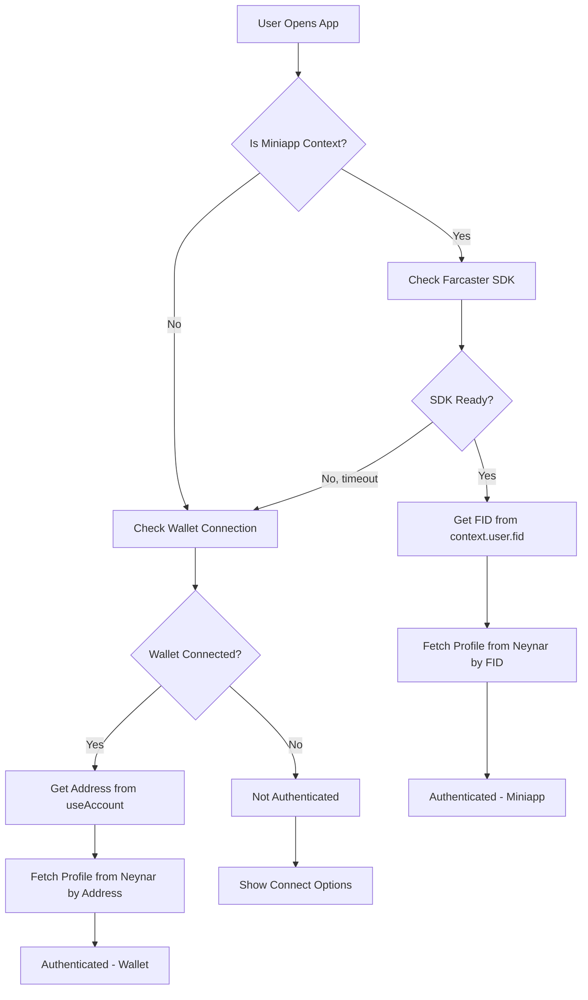

# 🔐 Unified Auth API Reference

**Version**: Phase 1.5 (December 2025)  
**Status**: Production Ready  
**Based on**: Coinbase MCP Best Practices (Dec 2025)

---

## Overview

The unified auth system provides a single source of truth for authentication across the entire Gmeowbased app. It combines Farcaster miniapp authentication with wallet-based authentication in a priority-based system.

**Key Features**:
- ✅ Single `useAuth()` hook for all pages
- ✅ Auto-detects miniapp context (Warpcast, base.dev)
- ✅ Priority order: Miniapp FID → Wallet address
- ✅ Type-safe with full TypeScript support
- ✅ Loading states and error handling
- ✅ No prop drilling required

---

## Quick Start

### 1. Import the Hook

```tsx
import { useAuth } from '@/lib/hooks/use-auth'
```

### 2. Use in Any Component

```tsx
function MyComponent() {
  const { fid, profile, isAuthenticated } = useAuth()
  
  if (!isAuthenticated) {
    return <ConnectWallet />
  }
  
  return <div>Welcome {profile?.displayName}!</div>
}
```

---

## AuthContextType Interface

```typescript
interface AuthContextType {
  // User identity
  fid: number | null
  address: `0x${string}` | undefined
  profile: FarcasterUser | null
  
  // Auth state
  isAuthenticated: boolean
  authMethod: 'miniapp' | 'wallet' | null
  
  // Miniapp context
  miniappContext: any | null
  isMiniappSession: boolean
  
  // Actions
  authenticate: () => Promise<void>
  logout: () => void
  
  // Loading states
  isLoading: boolean
  error: string | null
}
```

### Property Reference

| Property | Type | Description |
|----------|------|-------------|
| `fid` | `number \| null` | Farcaster ID (if authenticated via Farcaster) |
| `address` | `0x${string} \| undefined` | Wallet address (if connected) |
| `profile` | `FarcasterUser \| null` | Full Farcaster profile from Neynar |
| `isAuthenticated` | `boolean` | True if user has FID or wallet connected |
| `authMethod` | `'miniapp' \| 'wallet' \| null` | How user authenticated |
| `miniappContext` | `any \| null` | Farcaster SDK context (if in miniapp) |
| `isMiniappSession` | `boolean` | True if running in Warpcast/base.dev |
| `authenticate()` | `() => Promise<void>` | Manually trigger auth flow |
| `logout()` | `() => void` | Clear all auth state |
| `isLoading` | `boolean` | True while checking auth status |
| `error` | `string \| null` | Auth error message (if any) |

---

## Usage Examples

### Example 1: Dashboard (Require Auth)

**Use Case**: Page that requires user to be logged in

```tsx
import { useAuth } from '@/lib/hooks/use-auth'
import { LoadingSpinner } from '@/components/ui/loading'
import { ConnectWallet } from '@/components/auth/ConnectWallet'

export default function Dashboard() {
  const { fid, profile, isAuthenticated, isLoading } = useAuth()
  
  // Show loading state
  if (isLoading) {
    return <LoadingSpinner />
  }
  
  // Require authentication
  if (!isAuthenticated) {
    return (
      <div className="flex flex-col items-center gap-4 p-8">
        <h1 className="text-2xl font-bold">Login Required</h1>
        <p className="text-muted-foreground">
          Connect your wallet or use Warpcast to continue
        </p>
        <ConnectWallet />
      </div>
    )
  }
  
  // Authenticated user view
  return (
    <div className="space-y-6">
      <div className="flex items-center gap-4">
        
        <div>
          <h1 className="text-2xl font-bold">
            Welcome {profile?.displayName}!
          </h1>
          <p className="text-sm text-muted-foreground">
            FID: {fid}
          </p>
        </div>
      </div>
      
      <GMButton />
      <StreakDisplay />
      <QuestList />
    </div>
  )
}
```

---

### Example 2: Profile Page (Own vs Others)

**Use Case**: Show different UI for own profile vs other users

```tsx
import { useAuth } from '@/lib/hooks/use-auth'
import { useParams } from 'next/navigation'
import { EditProfileButton } from '@/components/profile/EditProfileButton'
import { FollowButton } from '@/components/profile/FollowButton'

export default function ProfilePage() {
  const params = useParams()
  const { fid: myFid } = useAuth()
  
  const profileFid = Number(params.fid)
  const isOwnProfile = myFid === profileFid
  
  return (
    <div className="space-y-6">
      <ProfileHeader fid={profileFid} />
      
      {/* Show edit button only for own profile */}
      {isOwnProfile ? (
        <EditProfileButton />
      ) : (
        <FollowButton fid={profileFid} />
      )}
      
      <ProfileStats fid={profileFid} />
      <BadgeCollection fid={profileFid} />
    </div>
  )
}
```

---

### Example 3: Quest Creation (Require Miniapp)

**Use Case**: Feature only available in Farcaster miniapp

```tsx
import { useAuth } from '@/lib/hooks/use-auth'

export default function QuestCreator() {
  const { isAuthenticated, isMiniappSession, authMethod } = useAuth()
  
  // Require authentication
  if (!isAuthenticated) {
    return (
      <div className="p-8 text-center">
        <h2 className="text-xl font-bold">Login Required</h2>
        <p className="text-muted-foreground mt-2">
          Please connect wallet or use Warpcast to create quests
        </p>
        <ConnectWallet />
      </div>
    )
  }
  
  // Require miniapp context
  if (!isMiniappSession) {
    return (
      <div className="p-8 text-center">
        <h2 className="text-xl font-bold">Miniapp Required</h2>
        <p className="text-muted-foreground mt-2">
          Quest creation is only available in the Warpcast miniapp.
          Open this page in Warpcast to continue.
        </p>
        <QRCode url="https://gmeowhq.art/quest/creator" />
      </div>
    )
  }
  
  // Authenticated in miniapp - show quest creator
  return (
    <div className="space-y-6">
      <h1 className="text-2xl font-bold">Create Quest</h1>
      <QuestForm />
    </div>
  )
}
```

---

### Example 4: Leaderboard (Optional Auth)

**Use Case**: Public page with auth-enhanced features

```tsx
import { useAuth } from '@/lib/hooks/use-auth'

export default function Leaderboard() {
  const { fid, isAuthenticated } = useAuth()
  
  return (
    <div className="space-y-6">
      <h1 className="text-2xl font-bold">Global Leaderboard</h1>
      
      {/* Show all rankings */}
      <div className="space-y-2">
        {rankings.map((rank) => (
          <LeaderboardRow
            key={rank.fid}
            {...rank}
            // Highlight current user's rank
            isCurrentUser={isAuthenticated && rank.fid === fid}
          />
        ))}
      </div>
      
      {/* Optional: Sticky user rank at top if authenticated */}
      {isAuthenticated && (
        <div className="sticky top-16 bg-card border rounded-lg p-4">
          <p className="text-sm text-muted-foreground">Your Rank</p>
          <p className="text-2xl font-bold">#{getUserRank(fid)}</p>
        </div>
      )}
    </div>
  )
}
```

---

### Example 5: Miniapp-Specific Features

**Use Case**: Use Farcaster SDK features when available

```tsx
import { useAuth } from '@/lib/hooks/use-auth'

export function ShareButton({ text }: { text: string }) {
  const { isMiniappSession, miniappContext } = useAuth()
  
  const handleShare = async () => {
    // Use Farcaster SDK composer in miniapp
    if (isMiniappSession && miniappContext?.actions?.composeCast) {
      try {
        await miniappContext.actions.composeCast({
          text,
          embeds: ['https://gmeowhq.art']
        })
      } catch (error) {
        console.error('Failed to open composer:', error)
      }
      return
    }
    
    // Fallback: Open Warpcast web composer
    const castUrl = `https://warpcast.com/~/compose?text=${encodeURIComponent(text)}`
    window.open(castUrl, '_blank')
  }
  
  return (
    <button 
      onClick={handleShare}
      className="btn btn-primary"
    >
      {isMiniappSession ? '📱 Share to Warpcast' : '🌐 Share'}
    </button>
  )
}
```

---

### Example 6: Loading States

**Use Case**: Handle auth loading and errors gracefully

```tsx
import { useAuth } from '@/lib/hooks/use-auth'

export function AuthAwareComponent() {
  const { isAuthenticated, isLoading, error, authenticate } = useAuth()
  
  // Show loading spinner
  if (isLoading) {
    return (
      <div className="flex items-center justify-center p-8">
        <LoadingSpinner />
        <p className="ml-2 text-muted-foreground">
          Checking authentication...
        </p>
      </div>
    )
  }
  
  // Show error with retry
  if (error) {
    return (
      <div className="p-8 text-center">
        <p className="text-destructive mb-4">
          Authentication failed: {error}
        </p>
        <button 
          onClick={authenticate}
          className="btn btn-primary"
        >
          Retry
        </button>
      </div>
    )
  }
  
  // Normal content
  return <div>Content here</div>
}
```

---

## Authentication Flow

### Priority Order

1. **Miniapp Context** (if in Warpcast/base.dev)
   - Check if embedded in iframe
   - Verify referrer (farcaster.xyz, warpcast.com, base.dev)
   - Load Farcaster SDK
   - Extract FID from `context.user.fid`
   - Fetch profile from Neynar by FID

2. **Wallet Address** (if wallet connected)
   - Get address from Wagmi `useAccount`
   - Fetch profile from Neynar by address
   - Extract FID from profile

3. **Not Authenticated**
   - Show connect options
   - User can connect wallet OR open in Warpcast

### Diagram



---

## Best Practices

### ✅ DO

- **Use `useAuth()` everywhere** - Don't create separate auth logic
- **Check `isLoading`** - Show loading states during auth checks
- **Handle errors gracefully** - Display `error` with retry option
- **Use `isAuthenticated`** - For showing login gates
- **Check `authMethod`** - To customize UX (miniapp vs wallet)
- **Respect `isMiniappSession`** - For miniapp-only features

### ❌ DON'T

- **Don't use `useMiniKitAuth`** - It's deprecated, use `useAuth` instead
- **Don't duplicate auth logic** - Let AuthContext handle it
- **Don't prop drill** - Use `useAuth()` directly in components
- **Don't ignore loading states** - Users need feedback
- **Don't assume miniapp** - Check `isMiniappSession` first

---

## Troubleshooting

### Issue: "useAuth must be used within AuthProvider"

**Cause**: Component rendered outside AuthProvider wrapper

**Solution**: Ensure AuthProvider wraps your app in `app/providers.tsx`

```tsx
// app/providers.tsx
<AuthProvider>
  <NotificationProvider>
    {children}
  </NotificationProvider>
</AuthProvider>
```

---

### Issue: Authentication not working in miniapp

**Cause**: SDK not ready or timeout

**Solution**: Check console for errors. AuthContext uses 10s timeout.

```bash
# Check logs
[AuthProvider] ✅ Miniapp context loaded: { fid: 12345, username: 'user' }
# OR
[AuthProvider] Not in miniapp context
```

---

### Issue: FID is null but wallet is connected

**Cause**: Wallet address has no Farcaster profile

**Solution**: User needs to create Farcaster account. Show helpful message:

```tsx
if (isAuthenticated && !fid && address) {
  return <div>Wallet connected, but no Farcaster profile found</div>
}
```

---

## Migration from Old Auth

### Old Pattern (useMiniKitAuth)

```tsx
// ❌ OLD - Don't use this anymore
import { useMiniKitAuth } from '@/hooks/useMiniKitAuth'

const { context, isFrameReady } = useMiniKit()
const auth = useMiniKitAuth({ 
  context, 
  isFrameReady,
  signInWithMiniKit,
  pushNotification,
  dismissNotification
})
```

### New Pattern (useAuth)

```tsx
// ✅ NEW - Use this instead
import { useAuth } from '@/lib/hooks/use-auth'

const { fid, profile, isAuthenticated, authMethod } = useAuth()
```

**Benefits**:
- ✅ No props needed (automatic detection)
- ✅ Works everywhere (not just Quest Wizard)
- ✅ Combines wallet + miniapp auth
- ✅ Single source of truth
- ✅ Better TypeScript support

---

## Related Documentation

- **Implementation**: `lib/contexts/AuthContext.tsx`
- **Hook**: `lib/hooks/use-auth.ts`
- **Architecture**: `docs/architecture/AUTH-CONSOLIDATION-PLAN.md`
- **Troubleshooting**: `docs/troubleshooting/auth-issues.md`
- **MCP Findings**: `docs/development/mcp-usage.md`

---

## Support

For issues or questions:
1. Check `docs/troubleshooting/auth-issues.md`
2. Review console logs (look for `[AuthProvider]` messages)
3. Verify AuthProvider is wrapping your app
4. Check that you're using `useAuth()` not `useMiniKitAuth`

**Last Updated**: December 1, 2025 (Phase 1.5)
