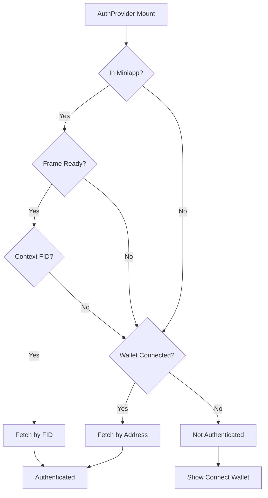

# Auth Consolidation Plan (Phase 1.5)

**Created**: December 1, 2025  
**Status**: Planning Phase  
**Priority**: 🔥🔥🔥 CRITICAL - Blocking Phase 2

---

## 🚨 Executive Summary

**Problem**: We have 3 different auth systems causing conflicts:
1. Quest Wizard uses `useMiniKitAuth` (hooks/useMiniKitAuth.ts - 178 lines)
2. Main app uses `useAccount` → `fetchUserByAddress` pattern
3. Onboarding doesn't use MiniKit context at all

**Solution**: Create unified `AuthContext` that wraps entire app

**Timeline**: 4-6 hours across 4 sections (1.19, 1.20, 1.21, 1.22)

**Blocking**: Phase 2 (Dashboard rebuild) cannot start without working auth

---

## 📋 Current Auth Systems (Fragmented)

### System 1: Quest Wizard Auth
- **Location**: `hooks/useMiniKitAuth.ts` (178 lines)
- **Used in**: `components/quest-wizard/QuestWizard.tsx`
- **Flow**: MiniKit context → FID → Neynar profile
- **State**: `authStatus`, `profile`, `signInResult`, `resolvedFid`
- **Problem**: Isolated from rest of app

### System 2: Main App Auth
- **Locations**: `app/page.tsx`, `app/Dashboard/page.tsx`, `app/profile/page.tsx`
- **Flow**: useAccount → wallet address → fetchUserByAddress → profile
- **State**: Local useState in each page
- **Problem**: Prop drilling, duplicate API calls

### System 3: Onboarding Auth
- **Location**: `components/intro/OnboardingFlow.tsx`
- **Flow**: Frame message validation OR wallet lookup
- **Problem**: Ignores MiniKit context entirely

---

## 🎯 Unified Auth Architecture

### AuthContext Design

```typescript
interface AuthContextType {
  // User identity
  fid: number | null                    // Farcaster ID
  address: `0x${string}` | undefined    // Wallet address
  profile: FarcasterUser | null         // Full Neynar profile
  
  // Auth state
  isAuthenticated: boolean
  authMethod: 'wallet' | 'miniapp' | null
  
  // Miniapp context
  miniappContext: MiniKitContextType | null
  isMiniappSession: boolean
  
  // Actions
  authenticate: () => Promise<void>
  logout: () => void
  
  // Loading/error states
  isLoading: boolean
  error: string | null
}
```

### Auth Flow (Priority Order)



### Provider Hierarchy

```
<WagmiProvider>
  <QueryClientProvider>
    <AuthProvider>          ← NEW
      <NotificationProvider>
        <ThemeProvider>
          {children}
```

---

## 📁 Files to Create (6 new files)

1. **`lib/contexts/AuthContext.tsx`** (~200 lines)
   - AuthContext definition
   - AuthProvider component
   - Auth state management
   - Priority: MiniKit context → wallet address

2. **`lib/hooks/use-auth.ts`** (~30 lines)
   - Simple wrapper around AuthContext
   - Throws error if used outside provider
   - TypeScript strict types

3. **`docs/architecture/AUTH-CONSOLIDATION-PLAN.md`** (~300 lines)
   - This document (already created)
   - Auth flow diagrams
   - MCP reference list

4. **`docs/api/auth/unified-auth.md`** (~200 lines)
   - AuthContext API documentation
   - useAuth hook usage examples
   - Code examples for each page type

5. **`docs/troubleshooting/auth-issues.md`** (~150 lines)
   - Common auth issues + solutions
   - Debug logging instructions
   - Mobile/miniapp troubleshooting

6. **`docs/development/mcp-usage.md`** (append ~50 lines)
   - MCP queries used in Phase 1.5
   - Coinbase MCP findings (miniapp patterns)
   - Supabase MCP findings (session management)
   - GitHub MCP findings (reference implementations)

---

## 🔧 Files to Update (6 files)

1. **`app/providers.tsx`**
   - Add `<AuthProvider>` wrapper
   - Import from `@/lib/contexts/AuthContext`

2. **`components/quest-wizard/QuestWizard.tsx`**
   - Replace `useMiniKitAuth` with `useAuth`
   - Remove duplicate auth logic
   - Test quest creation flow

3. **`hooks/useMiniKitAuth.ts`**
   - Add `@deprecated` JSDoc comment
   - Keep for backward compatibility
   - Remove in Phase 2

4. **`lib/miniappEnv.ts`**
   - Fix timeout: 5s → 10s (mobile networks)
   - Better error messages ("Please refresh" vs "timeout")
   - Add retry button option

5. **`lib/share.ts`**
   - Update `isMiniappContext()` function
   - Add base.dev to allowed hosts
   - Add debug logging

6. **`app/api/frame/route.tsx`**
   - Update CSP headers for base.dev
   - Add to frame-ancestors, script-src, connect-src

---

## 🧪 Testing Plan

### Unit Tests
- [ ] AuthContext provides all required fields
- [ ] useAuth hook throws error outside provider
- [ ] Auth priority order (miniapp > wallet)
- [ ] Logout clears all state

### Integration Tests
- [ ] Mobile Warpcast loads without timeout
- [ ] Base.dev validation passes (https://base.dev/apps/validate)
- [ ] Farcaster validation passes (https://miniapp.farcaster.xyz/validate)
- [ ] Quest Wizard works with new auth
- [ ] Dashboard shows user profile
- [ ] Profile page shows correct user
- [ ] Leaderboard shows "your rank"

### Manual Tests
- [ ] Test in Warpcast mobile app (real device)
- [ ] Test in Farcaster web (desktop browser)
- [ ] Test on base.dev preview
- [ ] Test in regular browser (no miniapp)
- [ ] Test with slow network (3G throttling)
- [ ] Test with no wallet connected
- [ ] Test with wallet but no Farcaster account

---

## 🎓 MCP Tools to Use

### Coinbase MCP
```typescript
// Query 1: Miniapp auth best practices
mcp_coinbase_SearchCoinbaseDeveloper("Farcaster miniapp authentication best practices")

// Query 2: Timeout handling
mcp_coinbase_SearchCoinbaseDeveloper("miniapp ready event timeout handling")

// Query 3: Base.dev requirements
mcp_coinbase_SearchCoinbaseDeveloper("base.dev miniapp requirements CSP headers")
```

### Supabase MCP
- Check session management patterns
- Review RLS policies for FID-based auth
- Find auth context examples

### GitHub MCP
- Search: "Farcaster auth provider"
- Search: "OnchainKit authentication"
- Search: "MiniKit context React"

---

## 📊 Success Criteria

### Phase 1.5 Complete When:
- ✅ AuthContext created and tested
- ✅ useAuth hook available everywhere
- ✅ Quest Wizard migrated (no errors)
- ✅ Mobile loading fixed (no 5s timeout)
- ✅ Base.dev validation passes
- ✅ All 7 integration tests pass
- ✅ Documentation complete

### Phase 2 Can Start When:
- ✅ Dashboard can call `useAuth()` successfully
- ✅ Profile page can detect own vs other profile
- ✅ Quest hub can check auth for creation
- ✅ Leaderboard can highlight user's rank
- ✅ No auth-related errors in console

---

## ⏭️ Next Steps

1. **Section 1.19** - Auth Audit & Design (2h)
   - Document all 3 auth systems
   - Design AuthContext API
   - Create auth flow diagrams
   - Query MCPs for patterns

2. **Section 1.20** - Miniapp Fixes (2h)
   - Fix mobile loading timeout
   - Fix base.dev integration
   - Update context detection
   - Test on all platforms

3. **Section 1.21** - Implementation (2h)
   - Create AuthContext.tsx
   - Create useAuth hook
   - Migrate Quest Wizard
   - Test integration

4. **Section 1.22** - Documentation (1h)
   - Write unified-auth.md
   - Write auth-issues.md
   - Document MCP findings
   - Update mcp-usage.md

**Total Time**: 4-6 hours  
**Target Completion**: End of December 2, 2025  
**Blocker for**: Phase 2 (Dashboard rebuild)

---

## 📚 References

- `docs/architecture/analysis/quest-wizard-audit.md` - Auth conflict documentation
- `docs/maintenance/NOV 2025/COMPREHENSIVE_AUDIT_REPORT.md` - "AUTHENTICATION ARCHITECTURE: FRAGMENTED"
- `docs/architecture/analysis/MINIAPP_FIXES.md` - Miniapp timeout errors
- `PHASE-1.5-AUTH-CONSOLIDATION.md` (root) - Complete Phase 1.5 plan
- `FOUNDATION-REBUILD-ROADMAP.md` (root) - Overall project roadmap
- `CURRENT-TASK.md` (root) - Current task status
